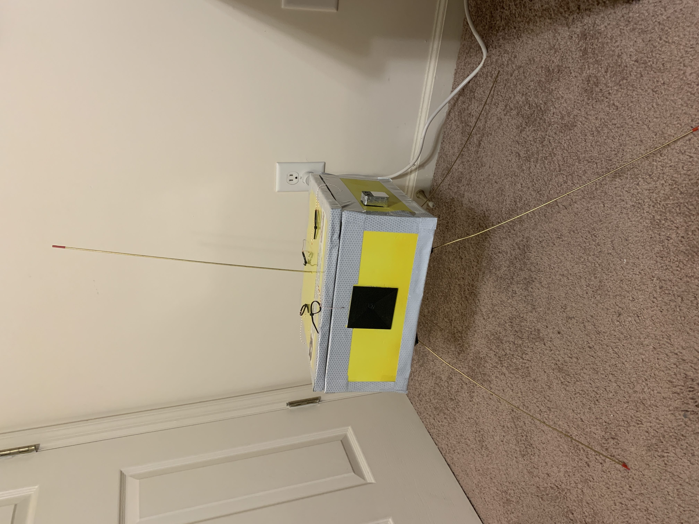
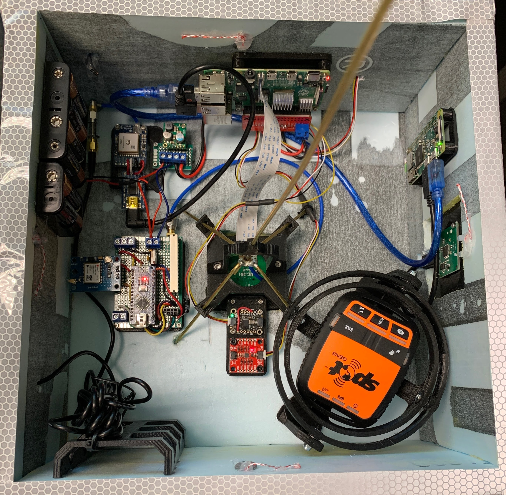
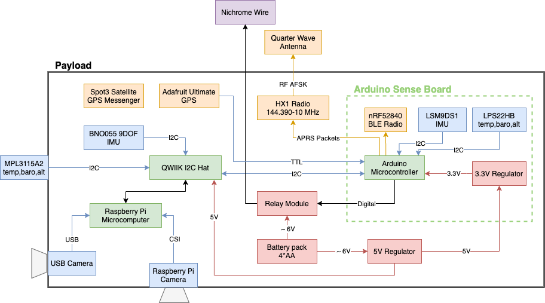
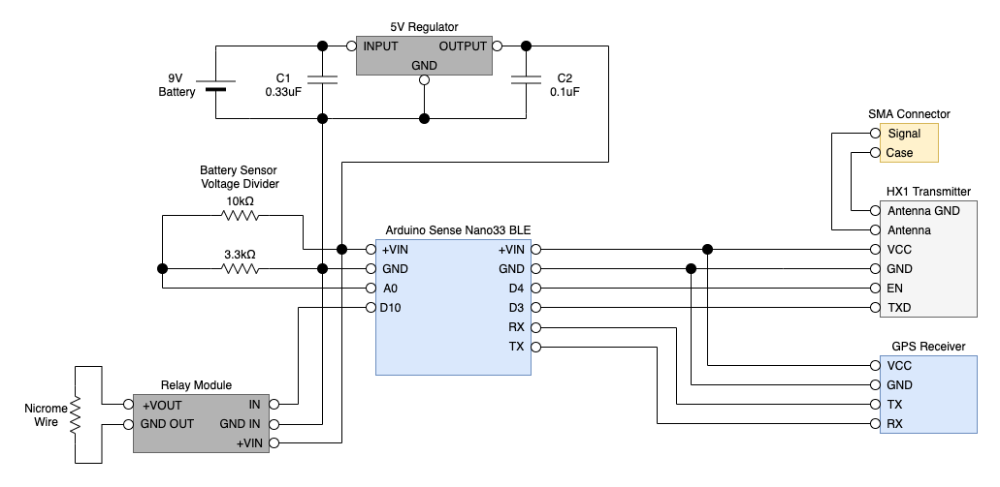

# ros-hab-dcs

Robot Operating System (ROS) High Altitude Balloon (HAB) Data Collection System (DCS)

**Status:** Launched maiden flight

## Introduction

This is a system to collect a high altitude balloon dataset utilizing ROS for aerial navigation algorithmic development.  The datasets contain downward facing visual imagery, side-facing imagery, IMU, GPS, internal and external barometric pressure, and internal and external temperature.  The system is designed to run Ubuntu Mate 20.04LTS with ROS Noetic Ninjemys on a Raspberry Pi 4 2GB and an Arduino Nano.

## Installation

Please see the installation guide for how to setup the software packages and run the system: [documentation/INSTALLATION.md](documentation/INSTALLATION.md)

## Hardware

</img>
</img>

### Sensors

* Downward Facing Camera - [Arducam for Raspberry Pi Camera 5MP OV5647 1080P](https://www.amazon.com/Arducam-Camera-Raspberry-Interchangeable-LS-2717CS/dp/B012ETE75I/?dchild=1&keywords=Arducam%2B12MP%2BIMX477&qid=1602259929&sr=8-3&th=1): [datasheet](https://cdn.sparkfun.com/datasheets/Dev/RaspberryPi/ov5647_full.pdf)
* Side Facing Camera - [Arducam 8MP 1080P USB Camera V2 Module](https://www.amazon.com/Arducam-Camera-Raspberry-Windows-Android/dp/B07YHK63DS/?dchild=1&keywords=USB+Camera+for+Raspberry+Pi&qid=1602001136&s=electronics&sr=1-3&th=1)
* IMU 1 - [BNO055](https://www.adafruit.com/product/4646): [tutorial](https://learn.adafruit.com/adafruit-bno055-absolute-orientation-sensor), [datasheet](https://cdn-learn.adafruit.com/assets/assets/000/036/832/original/BST_BNO055_DS000_14.pdf)
* IMU 2 - [ICM-20948](https://www.sparkfun.com/products/15335): [datasheet](https://cdn.sparkfun.com/assets/7/f/e/c/d/DS-000189-ICM-20948-v1.3.pdf), [repository](https://github.com/sparkfun/Qwiic_9DoF_IMU_ICM20948_Py)
* Barometric Pressure/Altitude/Temperature - [MPL3115A2](https://www.adafruit.com/product/1893): [tutorial](https://learn.adafruit.com/using-mpl3115a2-with-circuitpython), [datasheet](https://www.nxp.com/docs/en/data-sheet/MPL3115A2.pdf)
* GPS - [Adafruit Ultimate GPS](https://www.adafruit.com/product/746): [datasheets](https://learn.adafruit.com/adafruit-ultimate-gps/downloads)

### System Diagram

### Arduino Protoboard Schematic

# Flights

* February 8, 2021 (Auburn,AL to Milledgville,GA): [summary](documentation/Flight_1/Post_Flight_Analysis.md)
