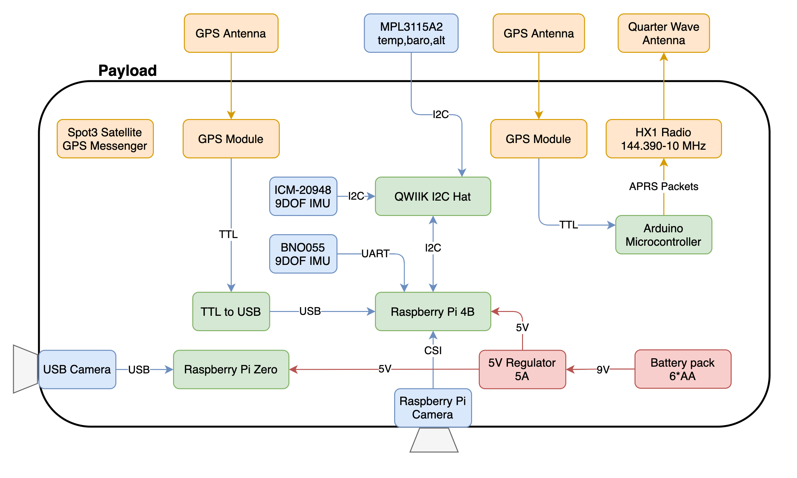
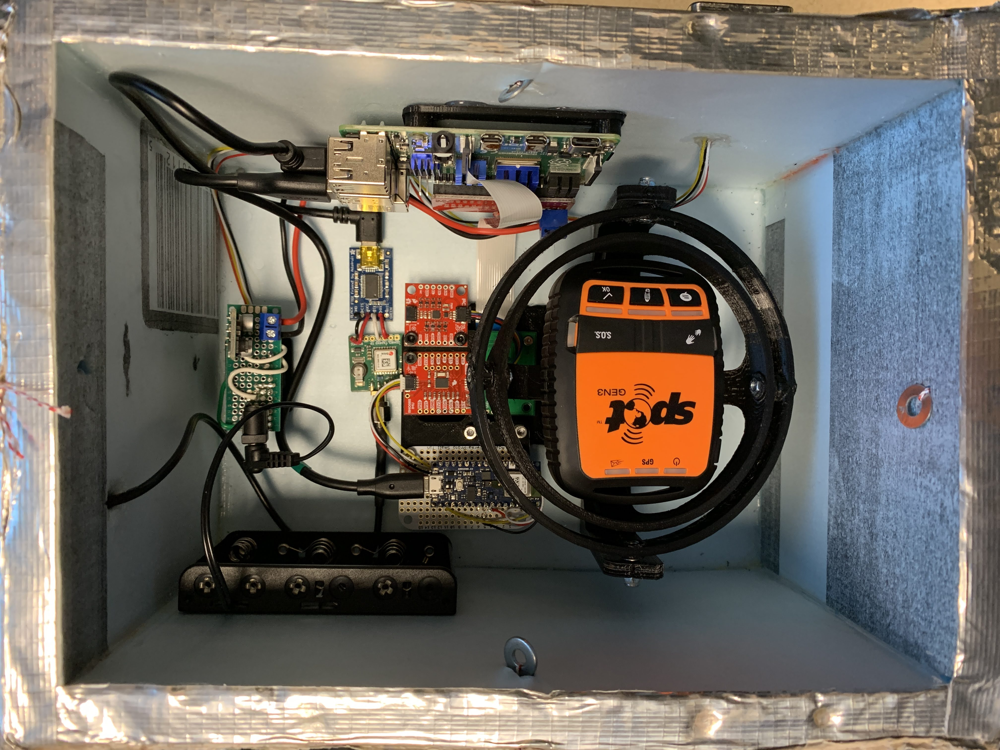

# ros-hab-dcs

Robot Operating System (ROS) High Altitude Balloon (HAB) Data Collection System (DCS)

**Status:** Launched maiden flight

## Introduction

This is a system to collect a high altitude balloon dataset utilizing ROS for aerial navigation algorithmic development.  The datasets contain downward facing visual imagery, side-facing imagery, IMU, GPS, external barometric pressure, and internal and external temperature.  The system is designed to run Ubuntu Mate 20.04LTS with ROS Noetic Ninjemys on a Raspberry Pi 4 and an Arduino Nano.

## Installation

Please see the installation guide for how to setup the software packages and run the system: [documentation/INSTALLATION.md](documentation/INSTALLATION.md)

## Photos
</img>
</img>
</img>
</img>
</img>
</img>

## Hardware

* SN01

     </img>
     </img>
     
* SN02

     </img>
     </img>
     