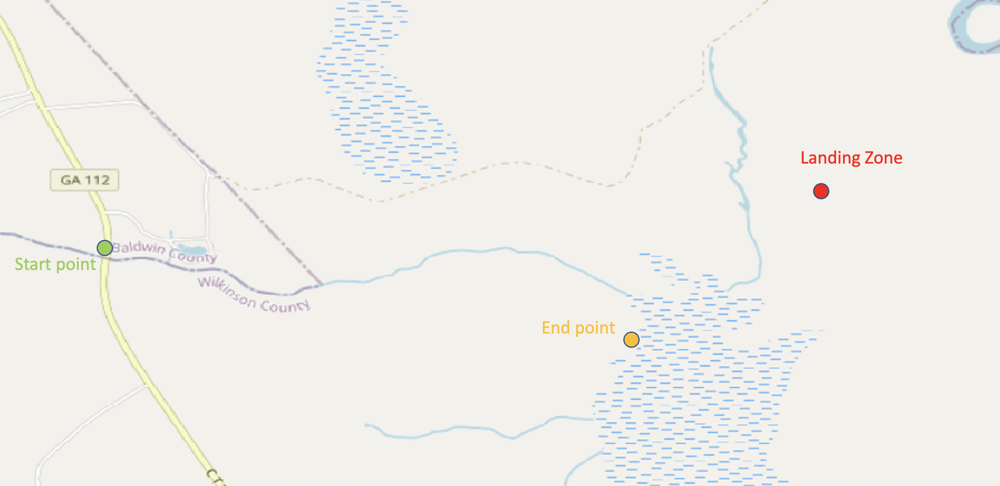

# Post Flight Analysis - Flight 1 of SN01

## Launch

* **Date/Time:** 8:26am CST February 8th, 2021
* **Location:** 32.573700,-85.535900

## Flight
</img>
* **Distance:** 142mi
* **Max Height:** TBD
* **Max Speed:** 140mph or 62.6m/s 

## Landing/Recovery
* **Landing Time:** 10:26am CST
* **Location**:  32.974091,-83.133568

### Attempt #1

</img>
</img>

## Strengths (What went well)

* Balloon inflation process: Took about 1 hour including setup as expected.
* Sensor systems at launch: all systems were in a "norminal" state
* Weather conditions: good temperatures, low cloud cover, and decent ground speed winds (10mph)
* APRS Mobile tracking system:  received packets during most of flight when GPS was responding and payload was at a sufficiently high altitude.
* Spot Tracker gave multiple messages at the landing site for a few days

## Weaknesses (What went poorly)

* Landed in a densly forested swamp/hunting grounds.  Hard to get to.  Likely caught in a tree.
* No real good plan to extract payload from tree.
* APRS Tracking GPS cutout at 39,000ft.
* APRS antenna is bulky and hard to transport
* Payload stand is easy to tip as it is two cardboard boxes taped together.
* Balloon inflation measurement was hard to get accurate.
* Payload travelled 300 miles away.  Could be shorter if lower weight.
* File sizes were quite large.  128GB is too little storage.
* Radar reflector was heavy and time consuming to make.  Design could be improved.
* GPS uFL connector broke during week before flight.  Needs more caution when disconnecting it.
* We have no reliable data on battery current draw.

## Action items for next flight

* Recovery team should wear orange vests for safety especially if it landed on hunting grounds.
* Recovery team should have a ball shaped weight (duct tape aluminum foil ball) with fishing line attached to throw over branch balloon is caught on.
* Use different GPS sensor rated for higher altitude flight for APRS tracking system.  Share Adafruit Ultimate GPS with Pi by using Arduino Micro instead of Arduino Nano. Alternatively use stratotrack mounted above radar reflector: https://www.highaltitudescience.com/products/stratotrack-aprs-transmitter
* Use digital pull scale to improve balloon inflation precision
* Research ways to improve antenna design to something lighter weight and more robust
* Construct payload ground stand out of scrap wood
* Launch flight at location with more attention placed on where landing zone is.  Landing just west of Auburn might be better than landing far away from Auburn.
* Remove side camera system if launching on new platform
* Use 256GB sd card for Pi instead of 128GB SD card or reduce framerate of camera by half
* Handwarmer added extra weight.  A smaller box size with new antenna might reduce weight dramatically while still staying warm.
* Construct radar reflector out of cereal box to reduce weight.  Apply aluminum tape before assembling to reduce time and amount of tape used.
* Add i2c battery monitor sensor: https://www.adafruit.com/product/904
* Yellow exterior color is harder to see in forest.  Bright orange or red is better.